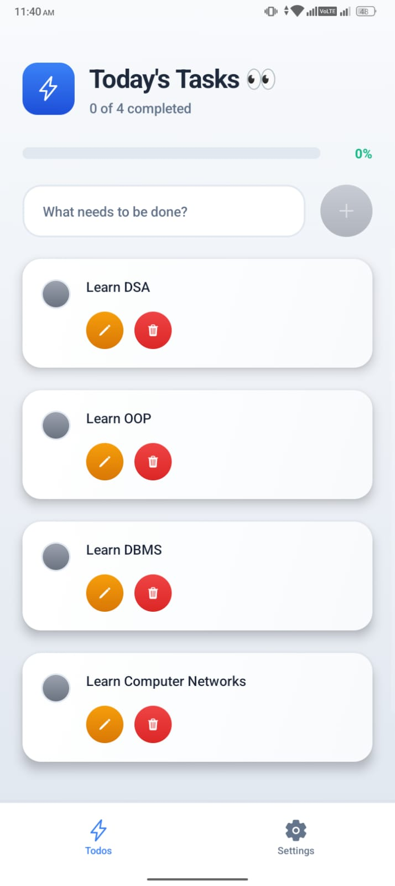
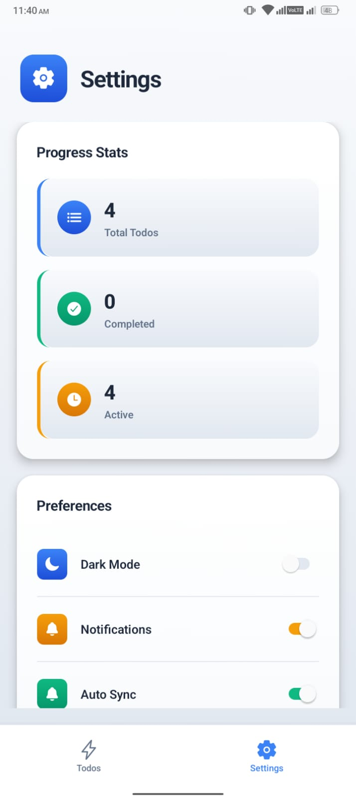

# ⚡ Todo App – React Native + Expo + Convex

A modern, clean, and minimal Todo application built using **React Native**, **Expo**, and **Convex** as the backend.

This app allows users to manage daily tasks with real-time sync and a smooth mobile UI.

---

## 📱 Screenshots

| Home Screen | Settings Screen |
| :---: | :---: |
|  |  |

### 🏠 Todos Screen
- View all active tasks
- Add new tasks
- Edit or delete tasks
- Mark tasks as completed
- Progress bar indicator

### ⚙️ Settings Screen
- View progress statistics
- Total todos
- Completed todos
- Active todos
- Dark mode toggle
- Notifications toggle
- Auto sync option

---

## 🚀 Tech Stack

- ⚛️ React Native
- 🚀 Expo
- 🔥 Convex (Backend as a Service)
- 🧠 React Hooks
- 🎨 Modern UI Design

---

## ✨ Features

- ✅ Add new tasks
- ✏️ Edit tasks
- 🗑 Delete tasks
- ✔️ Mark as completed
- 📊 Progress tracking
- 🌙 Dark mode support
- 🔄 Real-time sync using Convex
- 📱 Clean and responsive UI

---